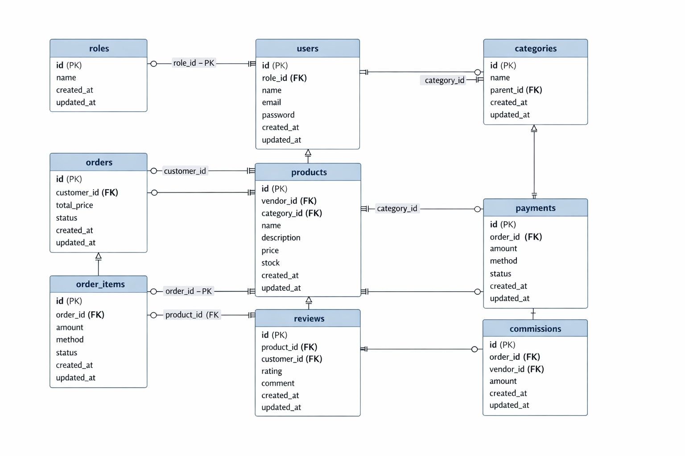

# Crystal Market

A full-featured multi-role marketplace application built with **Laravel 12**, **Inertia.js v2**, **Vue 3**, and **Tailwind CSS**. Features role-based dashboards, real-time stats, dark mode, and GSAP animations.

## Tech Stack

- **Backend**: Laravel 12, PHP 8.3
- **Frontend**: Vue 3 (Composition API + TypeScript), Inertia.js v2
- **Styling**: Tailwind CSS with dark mode support
- **Animations**: GSAP
- **Database**: MySQL
- **Auth**: Laravel Breeze with email verification

## Roles

The app has three user roles, each with a dedicated dashboard and feature set:

| Role | Description |
|------|-------------|
| **Admin** | Approves vendors, views all vendors and their products/categories |
| **Vendor** | Creates products/categories, manages orders, earnings, coupons, reviews |
| **Customer** | Browses products, places orders, writes reviews, messages vendors |

## Features

### Admin

- **Dashboard** with platform stats (users, orders, revenue, active vendors)
- **Vendor approval** workflow — review and approve pending vendor registrations
- **View all vendors** with product counts
- **Vendor detail** — see a vendor's products and categories

### Vendor

- **Dashboard** with real stats from the database:
  - Total sales revenue
  - Active product count
  - Pending orders
  - Average store rating
- **Product management** — full CRUD (create, edit, delete) with image upload and category assignment
- **Category management** — create, edit, delete with parent/child hierarchy and duplicate name validation
- **Order management** — view all orders containing your products, order detail with customer info and payment status
- **Earnings dashboard** — total and monthly revenue, top-selling products ranked by revenue, recent sales log
- **Coupon management** — create coupons (percentage or fixed discount), set expiry dates and usage limits, toggle active/inactive, delete
- **Reviews** — view all customer reviews across your products with star ratings and average rating
- **Messages** — reply to customer messages in conversation threads

### Customer

- **Dashboard** with order count, recent orders, and quick navigation
- **Browse products** — search by name, filter by category, view product details
- **Place orders** — select quantity, choose payment method (cash, credit card, PayPal), automatic stock validation and decrement
- **Order history** — list all orders with status tracking (pending, processing, shipped, delivered, cancelled)
- **Order receipt** — detailed view with items, quantities, prices, totals, and payment info
- **Write reviews** — star rating (1-5) and comment for purchased products, edit existing reviews
- **Message vendors** — start conversations from product pages, chat thread interface

### Shared

- **Messaging system** — conversation threads between customers and vendors with read receipts and unread badges
- **Dark mode** — toggle button in nav bar, persisted to localStorage, deep charcoal theme matching modern UI standards
- **GSAP animations** — page entrance animations (fade-up, fade-down, slide, scale), floating background orbs, staggered reveals
- **Flash messages** — success/error notifications with auto-dismiss
- **Responsive design** — mobile menu, adaptive grids, touch-friendly

## Database Schema



### Tables

| Table | Description |
|-------|-------------|
| `roles` | User roles (admin, vendor, customer) |
| `users` | User accounts with role assignment and vendor approval flag |
| `categories` | Hierarchical product categories (parent/child via `parent_id`) |
| `products` | Product listings with vendor ownership, category, price, stock, image |
| `orders` | Customer orders with status tracking and total price |
| `order_items` | Line items linking orders to products with quantity and price |
| `payments` | Payment records with method (cash/credit/PayPal) and status |
| `reviews` | Product reviews with star rating and comment |
| `coupons` | Vendor discount coupons with type, value, expiry, and usage tracking |
| `messages` | Conversation messages between users with read timestamps |

## How Roles Are Assigned

Roles are automatically assigned during registration based on these rules:

| Condition | Assigned Role |
|-----------|---------------|
| Email is `admin@gmail.com` | **Admin** |
| "Register as Vendor" toggle is checked | **Vendor** (requires admin approval before access) |
| Default (no toggle, non-admin email) | **Customer** |

### Admin Access

Register with the email **`admin@gmail.com`** — the app automatically assigns the admin role. Admin emails are configured in `config/roles.php`:

```php
'admin_emails' => [
    'admin@gmail.com',
],
```

You can add more admin emails to this array.

### Vendor Access

Check the **"Register as Vendor"** toggle on the registration page. After registering, the vendor account is **pending approval** — an admin must approve it from the Admin Dashboard before the vendor can access the platform.

### Customer Access

Register normally without checking the vendor toggle. No approval needed — customers get immediate access.

## Getting Started

### Prerequisites

- PHP 8.3+
- Composer
- Node.js 18+
- MySQL

### Installation

```bash
git clone https://github.com/belal-Salah1/market-place.git
cd market-place
composer install
npm install
cp .env.example .env
php artisan key:generate
```

### Database Setup

```bash
# Create a MySQL database named 'market', then:
php artisan migrate
php artisan db:seed --class=RoleSeeder
```

### Running

```bash
composer run dev
```

This starts the Laravel server, queue worker, log viewer, and Vite dev server concurrently.

### Testing

```bash
php artisan test --compact
```

## Enums

| Enum | Values |
|------|--------|
| `OrderStatus` | pending, processing, shipped, delivered, cancelled |
| `PaymentStatus` | pending, completed, failed |
| `PaymentMethodStatus` | cash, credit_card, paypal |
| `RoleStatus` | admin, customer, vendor |

## Project Structure

```
app/
  Controllers/       # Admin, Vendor, Customer, Product, Category, Order, Coupon, Review, Message, Earnings
  Enums/             # OrderStatus, PaymentStatus, PaymentMethodStatus, RoleStatus
  Http/Requests/     # Form request validation classes
  Models/            # Eloquent models with relationships
  Services/          # Report service classes
  Middleware/        # Role gating, vendor approval, dashboard redirect
resources/js/
  Pages/
    Admin/           # Dashboard, Vendors (Index, Show)
    Vendor/          # Dashboard, Products, Categories, Orders, Coupons, Earnings, Reviews
    Customer/        # Dashboard, Products (Index, Show), Orders (Index, Show), Reviews
    Messages/        # Index (conversations), Show (chat thread)
    Auth/            # Login, Register, ForgotPassword, etc.
    Profile/         # Edit, UpdateProfile, UpdatePassword, DeleteAccount
  Components/        # Reusable UI components
  Layouts/           # AuthenticatedLayout, GuestLayout
  composables/       # useGsap, useDarkMode, useDateFormat
```
